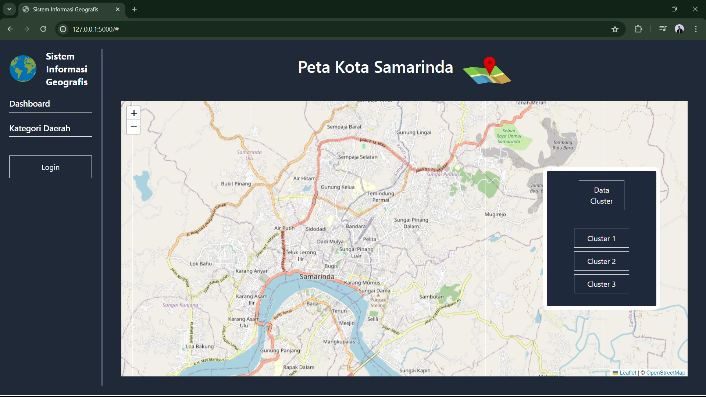
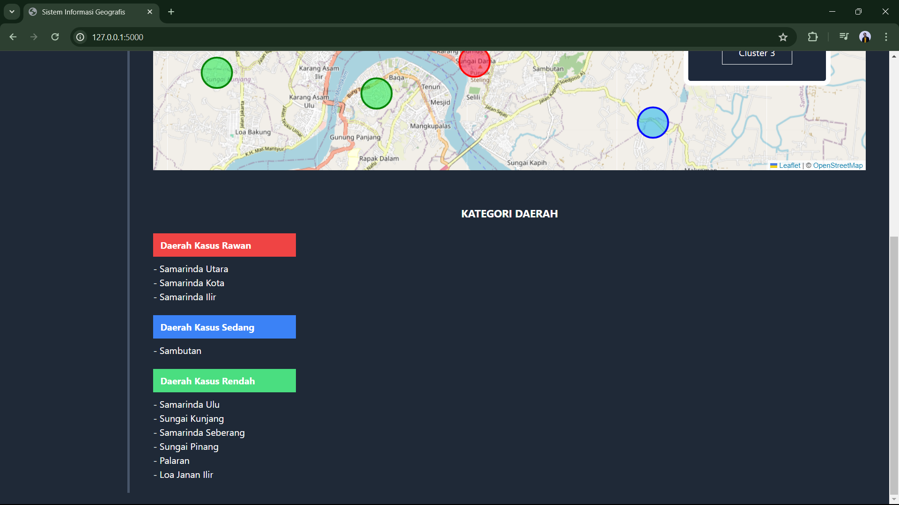
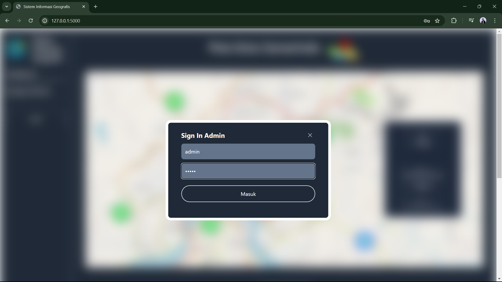
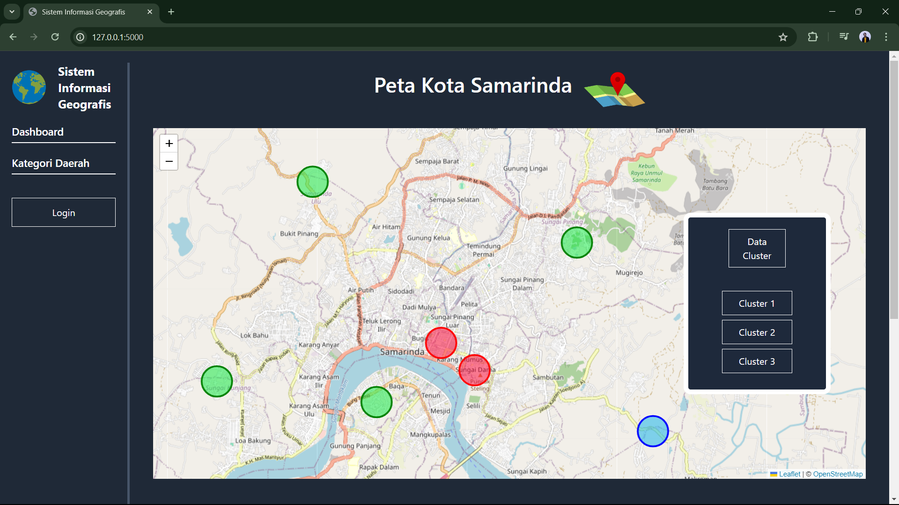
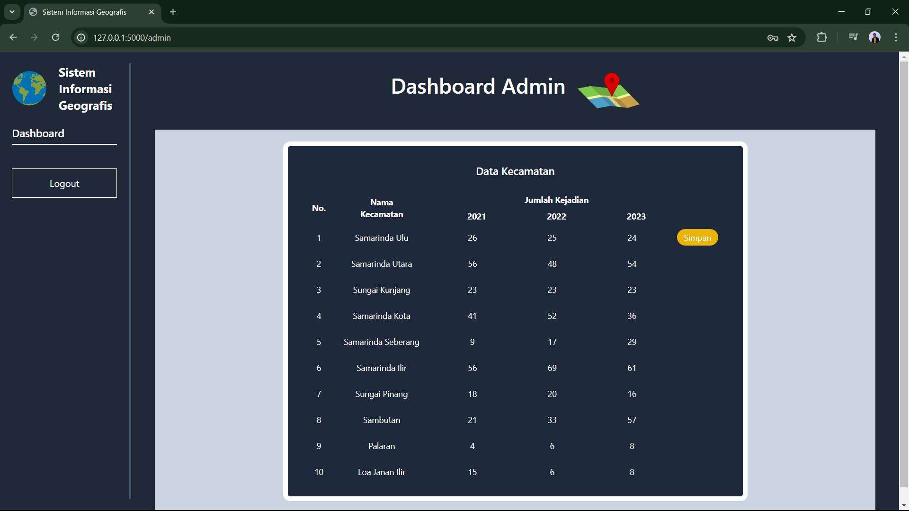

# Web Clustering Map

Web untuk mengelompokan tempat rawan kasus narkoba yang tercatat dari tahun 2021 hingga 2023 di Kota Samarinda. Dimana catatan atau data kasus setiap kecamatan di simpan kedalam database untuk diolah dan di <i>Clustering</i> untuk mengelompokan wilayah kecamatan kota Samarinda kedalam 3 <i>cluster</i>:
1. Cluster 1 : Sebagai daerah kasus rendah | kode Hijau
2. Cluster 2 : Sebagai daerah kasus sedang | kode Biru
3. Cluster 3 : Sebagai daerah kasus tinggi | kode Merah

Website ini dibangun menggunakan library <b>Flask</b> dari Python. Memiliki 2 halaman yaitu Dashboard dan Halaman Admin. Tampilan utama atau Dashboard sebagai berikut.

Terdapat sidebar dengan beberapa tombol navigasi seperti tombol dashboard sebagai tombol home, tombol kategori untuk melihat kategori wilayah kasus rendah hingga kasus tinggi.

Serta tombol login untuk menuju kehalaman admin.

Pada canvas Maps, menggunakan library <a href="https://leafletjs.com/">Leafletjs</a> pada javascript. Pada canvas terdapat kotak tombol untuk navigasi area cluster 1-3. Tombol cluster yang ditekan akan menampilkan area cluster dengan penanda lingkaran berwarna sesuai kategori wilayah berdasarkan banyaknya kasus.

Data cluster yang ditampilkan di canvas map berasal dari hasil proses clustering menggunakan algoritma <a href="https://medium.com/@afrizalfir/kmeans-clustering-dan-implementasinya-5e967dc604cf">K-means</a> dengan bantuan library <a  href="https://scikit-learn.org/stable/">Scikit-learn</a>. Data-data yang dihasilkan berasal dari database yang dapat diakses pada halaman admin sebagai berikut.

Data-data catatan kasus dari 2021, 2022, hingga 2023 dapat di<i>update</i> atau dirubah untuk disimpan kedalam database <a href="https://www.mysql.com/">MySql</a>

